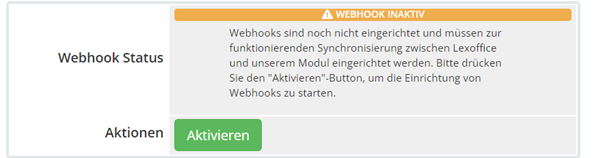
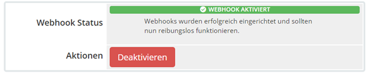

# Installation

In diesem Artikel erfahren Sie, wie Sie das Modul in WHMCS installieren und konfigurieren.

## Herunterladen

Sie können die neuste Modulversion im Kundencenter unter (https://portal.becker-software.de)[portal.becker-software.de]
abrufen.
Nach dem Download erhalten Sie eine .zip Datei mit dem Namen lexoffice.zip. Entpacken Sie diese Datei auf Ihrem
Computer.

## Hochladen

Im entpackten Order finden Sie einen uploads Ordner, bitte laden Sie den Inhalt dies Ordners in Ihr WHMCS Root
Verzeichnis hoch.

## Modulaktivierung

1. Melden Sie sich in Ihrem WHMCS-Adminbereich an und navigieren Sie zu "Setup" -> "Addon Modules".
2. Suchen Sie nach dem Modul und klicken Sie auf "Activate".
3. Es dauert nun einen kleinen Moment, bis die Installation des Moduls abgeschlossen ist.

## Rechnungsüberschreibung

Das Modul überschreibt die Erstellung von PDF Rechnungen in WHMCS und stattdessen liefert diese direkt von lexoffice
aus.

Dies gilt nur für Rechnungen, die ab dem angegebenen "Rechnungsyncronisation ab" Datum erstellt wurden. Kunden, die
Rechnungen nach diesem Datum erhalten, werden die PDF Rechnungen direkt von lexoffice in WHMCS angezeigt bekommen. Alle
Rechnungen, die vor dem angegebenen Datum erstellt wurden, werden von lexoffice gerendert und angezeigt.

Damit Rechnungen die vor dem "Rechnungsyncronisation ab" Datum noch angezeigt werden können, ist es erforderlich das Sie
ein paar Veränderungen in Ihrem Theme durchführen.

Begeben Sie sich bitte den Ordner, indem sich das aktive Theme Ihrer WHMCS Installation befindet. Beispielsweise
`/templates/six`.

### 1. Backup Ihrer invoicepdf.tpl

Das Modul überschreibt die invoicepdf.tpl damit Rechnungen direkt zum Kunden von lexoffice ausgeliefert werden können.
Ihre alten Kunden sehen dann den inhalt der invoicepdf-fallback.tpl, so können Sie Ihre alten Rechnungen direkt aus
WHMCS noch ausliefern.

### 2. Installation der neuen invoicepdf.tpl

Das Modul enthält im Ordner `uploads/templates/yourTheme/invoicepdf.tpl` die erforderliche Datei. Bitte ziehen Sie diese
Datei in den Ordner Ihres aktiven Themes.

## Custom Fields

> Hinweis: Ab Version 2.3.0 wird dieser Schritt automatisch mit Modulaktivierung erledigt.
> {style: info}

Bitte erstellen Sie unter Settings -> Custom Fields, ein Kundenfeld mit folgenden Eigenschaften.

Dieses Custom Field muss nun in den Moduleinstellungen angewählt werden. Die Änderung, dann mit Speichern bestätigen.

## Aktivieren der lexoffice API

<tabs>
    <tab title="Authorization Key">
        
        
Gehen Sie auf den Link "Schlüssel Abrufen" in den Moduleinstellungen, anschließend müssen Sie sich anmelden.

        
 Danach erhalten Sie einen <code>Autorisierungsschlüssel</code> welchen Sie kopieren und in das gleichnamige Feld in den Moduleinstellungen eintragen müssen.

    </tab>
    <tab title="Public API">

<warning>
    

        Die benutzung der Public API ist veraltet und wird in einer zukünftigen Version nicht mehr unterstützt.
    

</warning>

Bitte tragen Sie in die Moduleinstellungen Ihren lexoffice API Key ein. Diesen können Sie abrufen unter <a href="https://app.lexoffice.de/addons/public-api">API Key anfragen</a>.

</tab>
</tabs>

## Modulzugriff

Damit Sie auf den administrativen Bereich des Moduls zugreifen können, müssen Sie in den WHMCS Moduleinstellungen die
Zugriffsrollen festlegen. Diese Einstellung finden Sie am Ende der Moduleinstellungen für das lexoffice Modul.

## Webhooks

Webhooks erlauben die direkte Kommunikation von lexoffice mit WHMCS. Das bedeutet, dass das
Modul auf bestimmte Ereignisse in lexoffice reagieren kann, wie zum Beispiel das Erstellen einer neuen Rechnung. Sobald
dieses Ereignis auftritt, sendet lexoffice eine Nachricht, einen sogenannten Webhook, an das Modul, um es darüber zu
informieren. Das Modul kann dann entsprechend reagieren, indem es beispielsweise die Rechnung in WHMCS importiert oder
aktualisiert.

Bitte öffnen Sie in Ihren WHMCS Admin oben den Reiter `Addons -> lexoffice Modul -> Webhooks`. Dort aktivieren Sie die
Webhooks.

Soll Zustand:

## Testen

Sobald Sie die Einrichtung abgeschlossen haben, sollten Sie das Modul testen, um sicherzustellen, dass es wie erwartet
funktioniert. Dazu erstellen Sie einfach eine neue Rechnung für einen Testkunden, der Beleg wird dann automatisch in
lexoffice importiert.

Bitte testen Sie zunächst den Belegimport auf einem Testsystem, auf die korrekte Funktionsweise. Becker Software hat
keinen Einblick in Ihre Systeme, Belege und Daten. Bitte überzeugen Sie sich daher selbständig vor in Betriebnahme von
der Korrekten funktionsweise.

## Support

Wenn du Probleme bei der Installation oder Konfiguration des Moduls hast, zögern Sie nicht, den Support zu kontaktieren.
Wir
stehen gerne zur Verfügung, um Ihnen zu helfen.
