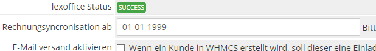

# Konfiguration

## Historische Rechnungen

Wenn Sie wünschen die alten Rechnungen *nicht* von lexoffice ausgeliefert werden, so können Sie dies in den
Moduleinstellungen festlegen.

Die Einstellung `Rechnungssynchronisierung ab` bestimmt, ab welchem Datum (einschließlich) keine Rechnungen mehr
importiert werden sollen. Alle Rechnungen vor dem angegebenen Datum werden mithilfe des WHMCS Rechnungstemplates
ausgeliefert.

> Achten Sie auf die korrekte Formatierung des Datums. Das Datum muss im Format `dd-mm-yyyy` angegeben werden.
> Z.B. `26-12-2022`
> {style: note}

Wünschen Sie z.B. das nur Rechnungen ab dem 26.12.2022 erstellt werden, so tragen Sie in dieses Feld `26-12-2022` ein
und
Speichern Sie Ihre Einstellungen. Alle Rechnungen bis zum 25.12.2022 werden dann noch über WHMCS ausgeliefert und nicht
importiert.

## Moduleinstellungen

### Lizenzschlüssel

Um das Modul nutzen zu können, ist es erforderlich, dass Sie eine gültige Lizenz besitzen. Diese Lizenz können Sie über
im Kundenportal unter https://portal.becker-software.de abrufen und muss in den Einstellungen des Moduls hinterlegt
werden, bevor Sie es nutzen können.

Bitte beachten Sie, dass das Modul ohne eine gültige Lizenz deaktiviert wird und
somit nicht verwendet, werden kann. Sollten Sie Probleme mit der Lizenzierung haben, wenden Sie sich bitte an unseren
Support unter info@becker-software.de.

### Rechnungssynchronisation ab

> Bitte stellen Sie sicher das in Ihrem Theme ordner die invoicepdf-fallback.tpl vorhanden ist.
> {style: info}

Die Einstellung `Rechnungssynchronisierung ab` bestimmt, ab welchem Datum (einschließlich) keine Rechnungen mehr
importiert werden sollen. Alle Rechnungen vor dem angegebenen Datum werden mithilfe des WHMCS Rechnungstemplates
ausgeliefert.

### Sende Einladung E-Mail

Diese Einstellung bestimmt, ob WHMCS Einladungen an neue Kunden senden soll, die in lexoffice erstellt oder durch den
Belegimport hinzugefügt wurden. Wenn diese Option aktiviert ist, wird WHMCS automatisch Einladungen an neue Kunden
senden, wenn sie in lexoffice erstellt werden.

### lexoffice Custom Field

Um das Modul nutzen zu können, muss das "lexoffice Custom Field" in den Einstellungen konfiguriert werden. Dafür muss
zunächst ein Custom Field in WHMCS erstellt werden, welches anschließend in den Modul-Einstellungen ausgewählt und
gespeichert werden muss.

### lexoffice => WHMCS

Hiermit können Sie den Import von lexoffice zu WHMCS steuern. Schalten Sie diese Option ab wird die Belegerstellung aus
lexoffice heraus zu WHMCS deaktiviert. Die Verbuchung von lexoffice zu WHMCS funktioniert weiterhin.

### \[DE\] & \[EN\] Einleitung Rechnung

Diese Einstellung ermöglicht es Ihnen, einen Text in Deutsch und Englisch einzugeben, der über der Rechnung in lexoffice
angezeigt wird. Dieser Text ist für den Kunden sichtbar und kann zum Beispiel für wichtige Hinweise oder Informationen
verwendet werden.

### \[DE\] & \[EN\] Schlusssatz Rechnung

Diese Einstellung ermöglicht es Ihnen, einen Text in Deutsch und Englisch einzugeben, der unter der Rechnung in
lexoffice angezeigt wird. Dieser Text ist für den Kunden sichtbar und kann zum Beispiel für wichtige Hinweise oder
Informationen verwendet werden.

### \[DE\] & \[EN\] Zahlungstext \{Gateway\}

Die Einstellung ermöglicht es Ihnen, verschiedene Zahlungstexte für unterschiedliche Zahlungsgateways hinterlegen. Diese
Texte werden dem Kunden auf der Rechnung in lexoffice angezeigt und können in deutscher und englischer Sprache definiert
werden. Sie können Platzhalter wie :date verwenden, die automatisch ersetzt werden. Sollten Sie weitere Platzhalter oder
Ideen für Zahlungstexte haben, können Sie sich gerne an den Support von Becker Software unter info@becker-software.de
wenden.